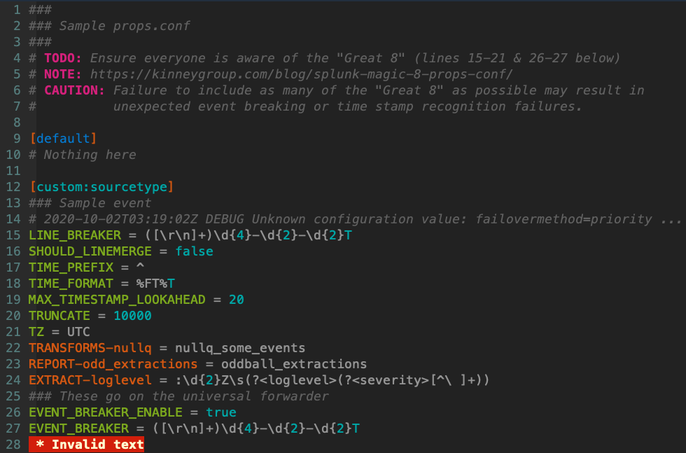

Syntax highlighting for Splunk's .conf files
=============

This project is unlicensed. If you wish to contribute, please fork this repository and submit a pull request via Github or email me: colbyw at gmail dot com.

Thanks to the many contributors to this project.

`vim-splunk` utilizes pattern matching to ensure proper keyword spelling and placement. In an effort to reduce CPU overhead, the majority of .conf file associations consist of a set of federated .vim files, one .vim per .conf(.spec).



Installation Instructions
=============

You can either clone the repository somewhere on your file system and use symlinks to the corresponding directories or clone to `~/.vim/bundle` as a submodule.

Vim native packages (`:help packages`):
```
if [ ! -d ~/.vim/pack/plugins/start ] ; then mkdir -p ~/.vim/pack/plugins/start ; fi
cd ~/.vim/pack/plugins/start
git clone https://github.com/yorokobi/vim-splunk.git
```

Symlink instructions:
```
mkdir ~/git-projects
cd ~/git-projects
git clone https://github.com/yorokobi/vim-splunk.git
if [ ! -d ~/.vim/ftdetect ] ; then mkdir -p ~/.vim/ftdetect ; fi
if [ ! -d ~/.vim/syntax ] ; then mkdir -p ~/.vim/syntax ; fi
ln -s ~/git-projects/vim-splunk/ftdetect/splunk.vim ~/.vim/ftdetect/splunk.vim
ln -s ~/git-projects/vim-splunk/syntax/* ~/.vim/syntax/
```
Bundle instructions:
```
cd ~/.vim/bundle
git clone https://github.com/yorokobi/vim-splunk.git
```
Submodule instructions:
```
cd ~/your/vim/bundle/repo
git submodule add https://github.com/yorokobi/vim-splunk.git
git commit -am "Added vim-splunk as a submodule"
```
